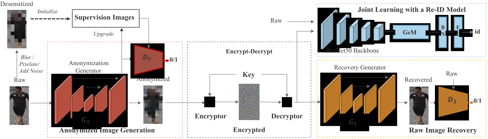
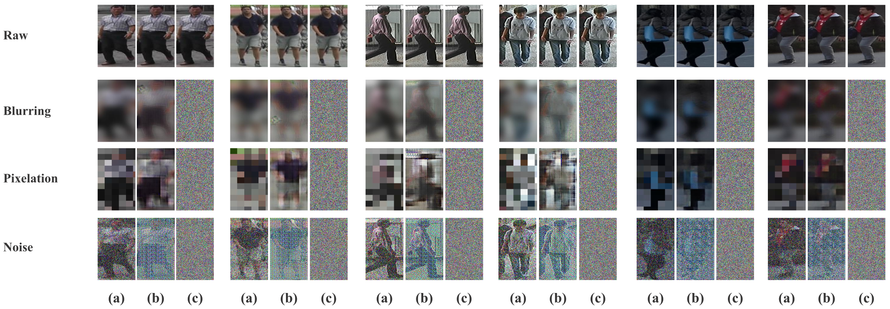

# SecureReID: Privacy-Preserving Anonymization for Person Re-Identification (TIFS 2024)

**The official pytorch implementation of "SecureReID: Privacy-Preserving Anonymization for Person Re-Identification" (TIFS 2024).**



> [SecureReID: Privacy-Preserving Anonymization for Person Re-Identification](https://ieeexplore.ieee.org/xpl/RecentIssue.jsp?punumber=10206 )
>
> Mang Ye, Wei Shen, Junwu Zhang, Yao Yang, Bo Du
>
> Wuhan University
>
> **Abstract** Anonymization methods have gained widespread use in safeguarding privacy. However, conventional anonymization solutions inevitably lead to the loss of semantic information, resulting in limited data utility. Besides, existing deep learning-based anonymization strategies inadvertently alter the identities of pedestrians, rendering them unsuitable for re-identification (Re-ID) tasks. Beyond these limitations, we propose a joint learning reversible anonymization framework that can reversibly generate full-body anonymized images with little performance drop on Re-ID tasks. Despite these advancements, we reveal that the anonymization methods are vulnerable to model attacks, where attackers can utilize the anonymization model and public data to perform recovery and Re-ID tasks on anonymized images. To defend against the potential attack, we introduce the identity-specific encrypt-decrypt (ISED) architecture for enhanced security, where the anonymized images are encrypted using the specific key for each identity. It renders the images computationally inaccessible to attackers while allowing for seamless reversal without loss using the corresponding keys. Extensive experiments demonstrate that the anonymization framework can guarantee Re-ID performance while protecting pedestrian privacy. In addition, we provide both empirical and theoretical evidence to demonstrate the feasibility of model attacks and the effectiveness of our ISED strategy.


## Last Update

**2024/01/30** Accepted by IEEE Transactions on Information Forensics and Security in 2024 (TIFS 2024). 

**2022/11/21** We have released the official codes.


## Start Guideline

### 1. Setup

<details open>
<summary>Install</summary>

- Clone repo and install [requirements.txt](./requirements.txt) in a [**Python>=3.7.10**](https://www.python.org/) environment, including [**PyTorch>=1.8**](https://pytorch.org/get-started/locally/).

```bash
git clone https://github.com/shentt67/SecureReID.git
cd SecureReID
pip install -r requirements.txt
```

</details>

<details open>
<summary>Prepare Datasets</summary>

- Download Market1501, MSMT17 and CUHK03 datasets from http://www.liangzheng.org/Project/project_reid.html to <path_to_root_of_datasets>.
- Extract dataset and rename to `market1501`. The data structure would like:

```
<path_to_root_of_datasets/market1501>
    market1501 
        bounding_box_test/
        bounding_box_train/
        query/
```

- Split Market1501 training set into a smaller training set (80%) and a validation set (20%). Furthermore, the validation set is split into a validation gallery set (80%) and a validation query set (20%).

```bash
python3 data/train_split.py --dataset_root_dir '<path_to_root_of_datasets>' --dataset_name 'market1501'
```

- The data structure would like:


```
<path_to_root_of_datasets/market1501_val>
    market1501 
        bounding_box_test/
        bounding_box_train/
        query/
        bounding_box_val_gallery/
        bounding_box_val_query/
```

- MSMT17 can be split by changing 'market1501' to  'msmt17', CUHK03 can be split using Matlab.

</details>

### 2. Train

<details open>
<summary>Notes</summary>

- Replace **<path_to_root_of_datasets>** by your own path to the root of datasets, e.g., /data/Dataset.
- For other datasets, **replace 'market1501' by 'msmt17' or 'cuhk03'**.
- For other desensitization methods,  **INPUT.TYPE** and **INPUT.RADIUS** can be changed from **mosaic 24.0** to **blur 12.0** or **noise 0.5**.
- Jointly training with upgradation, replace **<R1_update>** by the **rank-1 accuracy constraint**. When the rank-1 accuracy is higher than the constraint plus a small negative value (set to -0.05) and the privacy constraint is satisfied simultaneously, the supervision will be substituted by the current learned anonymized images.

</details>

<details open>
<summary>Baseline</summary>

- Train our re-id baseline on hybrid images (raw and desensitized):


```bash
python3 tools/main.py --config_file='configs/AGW_baseline.yml' DATASETS.ROOT_DIR "<path_to_root_of_datasets>" DATASETS.NAMES "('market1501_val')" INPUT.TYPE "mosaic" INPUT.RADIUS "24.0" OUTPUT_DIR "('./log/market1501/market1501-base-mosaic')" MODEL.MODE "C"
```

</details>

<details open>
<summary>Our Model w/o Supervision Upgradation</summary>

- Jointly train our models (Anonymization, Re-ID and Recovery) without upgradation:


```bash
python3 tools/main.py --config_file='configs/AGW_baseline.yml' DATASETS.ROOT_DIR "<path_to_root_of_datasets>" DATASETS.NAMES "('market1501_val')" INPUT.TYPE "mosaic" INPUT.RADIUS "24.0" OUTPUT_DIR "('./log/market1501/market1501-wosu-mosaic')"
```

</details>

<details open>
<summary>Our Model w/ Supervision Upgradation</summary>

- Jointly train our models (Anonymization, Re-ID and Recovery) with upgradation:


```bash
python3 tools/main.py --config_file='configs/AGW_baseline.yml' DATASETS.ROOT_DIR "<path_to_root_of_datasets>" DATASETS.NAMES "('market1501_val')" INPUT.TYPE "mosaic" INPUT.RADIUS "24.0" OUTPUT_DIR "('./log/market1501/market1501-full-mosaic')" MODEL.VAL_R1 "<R1_update>"
```

</details>

### 3. Test

The testing command is just the incremental version of the training command, which is prefixed with the training command and suffixed with:

- **TEST.EVALUATE_ONLY** is set as 'on' to indicate performing test.
- **MODEL.PRETRAIN_CHOICE** is set as 'imagenet' or 'self', refer using pretrained resnet50 backbone or pretrained re-id baseline respectively. Set as 'self' in testing.
- **MODEL.PRETRAIN_DIR** is set as the directory of model to be evaluated.

<details open>
<summary>Baseline</summary>

```bash
python3 tools/main.py --config_file='configs/AGW_baseline.yml' DATASETS.ROOT_DIR "<path_to_root_of_datasets>" DATASETS.NAMES "('market1501')" INPUT.TYPE "mosaic" INPUT.RADIUS "24.0" OUTPUT_DIR "('./log/market1501/test/market1501-base-mosaic')" MODEL.MODE "C" TEST.EVALUATE_ONLY "('on')" MODEL.PRETRAIN_CHOICE "('self')" MODEL.PRETRAIN_DIR "./log/market1501/market1501-base-mosaic"
```

</details>

<details open>
<summary>Our Model w/o Supervision Upgradation</summary>

```bash
python3 tools/main.py --config_file='configs/AGW_baseline.yml' DATASETS.ROOT_DIR "<path_to_root_of_datasets>" DATASETS.NAMES "('market1501')" INPUT.TYPE "mosaic" INPUT.RADIUS "24.0" OUTPUT_DIR "('./log/market1501/test/market1501-wosu-mosaic')" TEST.EVALUATE_ONLY "('on')" MODEL.PRETRAIN_CHOICE "('self')" MODEL.PRETRAIN_DIR "./log/market1501/market1501-wosu-mosaic"
```

</details>

<details open>
<summary>Our Model w/ Supervision Upgradation</summary>

```bash
python3 tools/main.py --config_file='configs/AGW_baseline.yml' DATASETS.ROOT_DIR "<path_to_root_of_datasets>" DATASETS.NAMES "('market1501')" INPUT.TYPE "mosaic" INPUT.RADIUS "24.0" OUTPUT_DIR "('./log/market1501/test/market1501-full-mosaic')" TEST.EVALUATE_ONLY "('on')" MODEL.PRETRAIN_CHOICE "('self')" MODEL.PRETRAIN_DIR "./log/market1501/market1501-full-mosaic"
```

</details>


## Results & Pretrained Models

Pretrained models will be published later.

The detailed results can be found in the main [paper](https://doi.org/10.1145/3503161.3548766) and the results of widely used non-protective Re-ID model AGW can be found [here](https://github.com/mangye16/ReID-Survey).


- **Qualitative Results**



> Qualitative results. (a)/(b)/(c) are desensitized/anonymized/encrypted images. Encrypted images achieve a strong visual confusion effect.


- **Quantitative Results of Re-ID**

  - The four values separated by '/' are corresponding to the rank-1 accuracy under raw/crossed/protected settings in the main paper.

    - **Market-1501 Dataset**

      |            |        Blur         |       Mosaic        |        Noise        |
      | :--------: | :-----------------: | :-----------------: | :-----------------: |
      |    Base    | 84.8/40.1/18.3/67.3 | 87.4/75.3/70.9/64.3 | 75.9/50.8/41.7/68.7 |
      | Ours w/o U | 83.1/68.3/46.8/75.8 | 86.3/80.1/75.1/73.2 | 90.4/77.5/67.5/84.4 |
      |    Ours    | 91.6/88.2/82.5/89.2 | 89.4/88.5/86.8/87.0 | 91.7/83.5/83.8/91.2 |

    - **MSMT17  Dataset**

      |            |        Blur         |       Mosaic        |        Noise        |
      | :--------: | :-----------------: | :-----------------: | :-----------------: |
      |    Base    | 30.5/21.3/16.2/15.2 | 25.0/16.3/14.6/10.6 | 24.1/20.1/18.5/18.2 |
      | Ours w/o U | 43.6/28.4/10.0/14.7 | 34.3/26.2/24.6/20.5 | 41.9/36.0/29.4/31.3 |
      |    Ours    | 51.5/51.1/50.5/48.7 | 48.6/49.1/48.5/48.1 | 46.9/48.1/46.2/46.0 |

    - **CUHK03  Dataset**

      |            |        Blur         |       Mosaic        |        Noise        |
      | :--------: | :-----------------: | :-----------------: | :-----------------: |
      |    Base    | 30.4/14.6/10.4/8.2  | 28.5/17.7/15.1/8.8  |  14.0/9.1/8.6/8.1   |
      | Ours w/o U | 31.6/13.8/8.9/14.3  | 24.9/24.2/19.6/12.1 | 28.1/30.4/30.4/31.9 |
      |    Ours    | 41.9/39.2/35.3/33.2 | 38.8/37.8/30.4/27.6 | 35.8/36.4/37.9/41.9 |

## Citation

Please cite our work in your publications if it helps your research:

```
@article{ye2024securereid,
  title={SecureReID: Privacy-Preserving Anonymization for Person Re-Identification},
  author={Ye, Mang and Shen, Wei and Zhang, Junwu and Yang, Yao and Du, Bo},
  journal={IEEE Transactions on Information Forensics and Security},
  year={2024},
  publisher={IEEE}
}
@inproceedings{zhang2022learnable,
  title={Learnable privacy-preserving anonymization for pedestrian images},
  author={Zhang, Junwu and Ye, Mang and Yang, Yao},
  booktitle={Proceedings of the 30th ACM International Conference on Multimedia},
  pages={7300--7308},
  year={2022}
}
```

Contact: [yemang@whu.edu.cn](mailto:yemang@whu.edu.cn), [weishen@whu.edu.cn](mailto:weishen@whu.edu.cn)

